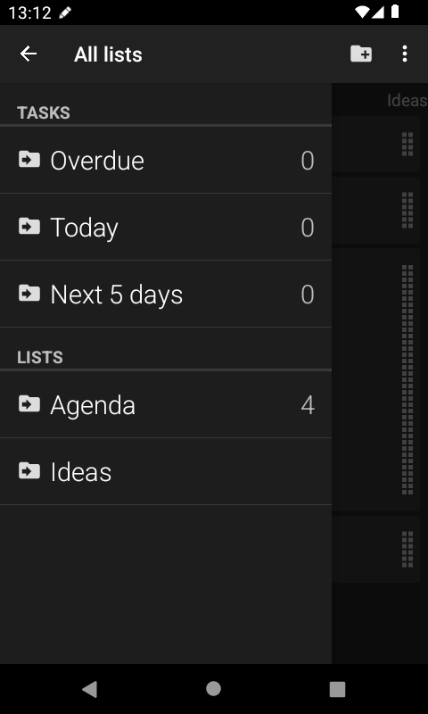
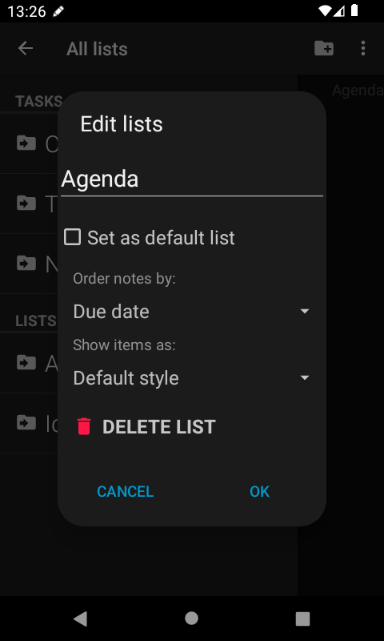
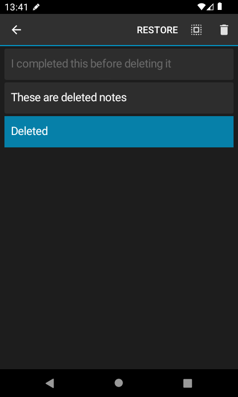
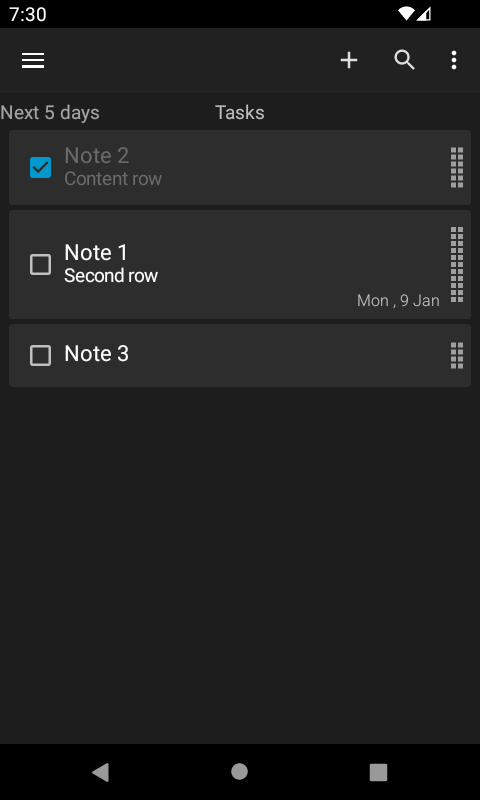
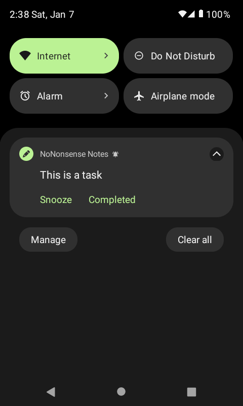
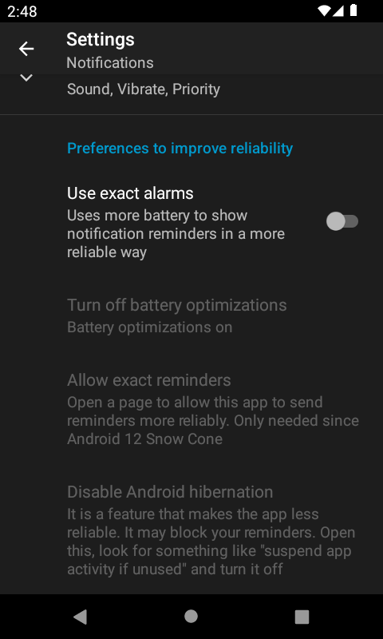
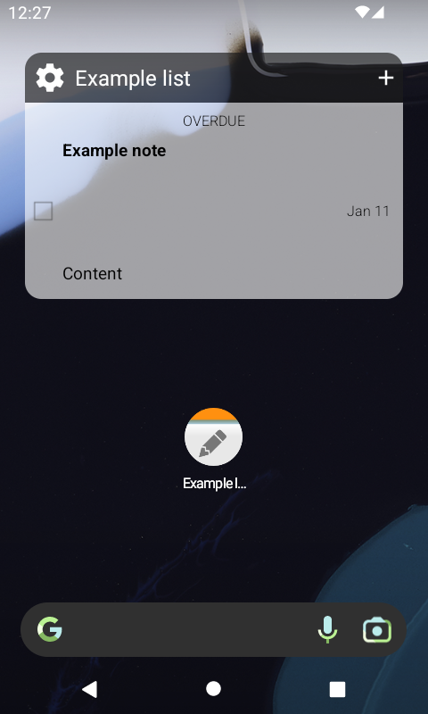
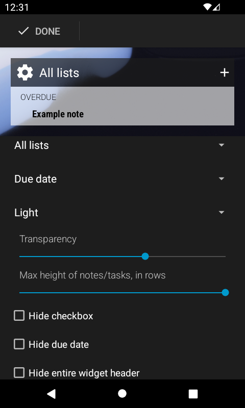

# No Nonsense Notes app tutorial

Over time, this app developed to be its own thing, so it can feel disorientating for new users.
This document will explain every unintuitive feature of the app, to turn you into a pro in no time!
This guide is written for the phone layout. The tablet layout is a bit different,
it's optimized for bigger screens.

## Navigating the app

### The main view


Here you see:
* all your lists: you can swipe left and right to navigate between them
* 2 tasks, ordered by due date: the 2° one is "completed" or "done"
* the due date of each task, in the corner on the right
  * you can choose how it is displayed
* a `+` button to create a new note
* a search button to find and open one of your notes
  * it supports voice search
  * if you type, you get suggestions. click on one to open that note
* the hamburger menu `☰` which can open the drawer menu on the left
* the 3 dots menu `⋮` which has many options
  * "Sync" forces an update of the files on the SD card 
  * archive opens the "deleted tasks page", also called "note archive"
  * "clear completed" can delete all tasks marked as completed from the current list only
  * "settings" opens the app preferences page

### The left drawer



Here you see:
* the "folder+" icon on the action bar: press it to create a new list
* the "tasks" section, which has 3 views that you can use to quickly see some of your notes
  * For example, click "today" to see tasks due today
  * hold your finger on one of those 3 items to select it as default view
    * it will be always on the left of every other list
    * in the 1° photo you saw that I choose "next 5 days" as my default view
* the "lists" section has all the note lists you made
  * Since "agenda" has 4 un-checked (incomplete) tasks, you see "4" next to it
  * hold your finger on one of those lists to open a popup to edit it

### The list edit dialog



In this dialog you can:
* choose any name for the list
  * They are sorted alphabetically. If you want it to appear first, put a `_`, like "_zebra" 
* set one list as default
  * the app will open on that list
  * links you share to this app from your browser will go into this list
* choose how notes are ordered on this list in particular
  * "latest updated" shows first the notes that you edited more recently
  * "due date" also groups the notes by week, month and year
  * "manual" lets you drag and reorder the notes
* choose how to show the list items
  * "checkable tasks" have a check-box and a due date
  * "simple notes" don't, but they can still have reminders and notifications

### The archive view



Here you can:
* see a list of notes you deleted
  * those with the darker text were completed before being deleted 
* select one or more notes by touching them
* select them all with the icon next to the trash bin
* delete the selected notes with the trash bin icon
* restore the selected notes by pressing "restore"
* search among the deleted notes with the provided search bar

### The settings page


Here you can see all our settings. They are laid out linearly.
I recommend checking all of them, but in particular the **notification settings**,
where you can customize the behavior of notifications and bypass some android
design flaws to **make reminders appear more reliably**.
The **backup** settings are also very useful: you can save the notes as a json file,
and restore them if you re-install the app even on another phone.

### The task detail panel


Here you can:
* edit the task text
  * the 1° line is the title, the rest is the content of the note
  * links and phone numbers can be highlighted and clicked to open them
* set the note as "done" with the check-box
* set a due date for the note. This note is due "Thursday, 16 march"
  * you can choose how this date is displayed: go see the settings
* remove the due date with the `X` on its right
* add as many reminders as you want
* choose the date and time of each reminder, separately.
  * in this case, the reminder will show a notification on "October 5" at "11:59 PM"
* remove the reminder with the `X` on its right
* choose on which week days the reminder will repeat
  * touch a week day to select it: you see the colored underline.
  * Now when you dismiss the reminder, it will be rescheduled in the chosen day, at the same hour
  * Very useful for creating weekly routines: make things automatic!
* interact with the action bar on top
  * the `<-` arrow **saves** the note and brings you back to the list 
  * the `+` button saves this note and reopens this page to let you write a new note
  * the trash bin icon deletes this note, sending it to the "archive"
  * then, in the `⋮` menu, you have
    * "cancel", which brings you back to the menu but **discards** your edits
    * "share", to send the title & content of this note to another app, as plain text
    * "lock note", to apply a password in order to protect your note
    * "time machine", which shows you the "task history" page

### The task history page


Here you can:
* drag the indicator to see all previous version of the note. Only the ones that you saved
* press "cancel" to undo and go back
* find a version you like, press "done", and overwrite the current note with that content

## App features

Navigating the app will show you (almost) all it has to offer.
However, there are some features that still need to be explained.

### Passwords
You can edit the password in the settings, and apply it to single notes.
Passwords protect every aspect of the note. Unless the user provides the password:
* only the note's title is visibile, not the content
* the note can't be deleted
* its reminders can't be edited. The notification still appear, don't worry
* ~~backups and restores will be blocked~~ (still working on this one...)

### SD sync
Your notes are saved internally by the app, and you can get an updated representation of the notes
in the form of org files (=plain text) if you enable "sd sync" under the "sync" settings. Then you
can sync those files and use this app together with emacs in org mode, for example. Changes go both
ways: edit the org files with a text editor to update notes in the app. Sync is automatic, but you
can force it by pressing "Sync" from the menu next to the search bar. The app will produce 1 org
file for each list. Deleting an org file deletes the equivalent list in the app, and adding a file
creates a new list with the same name and all the notes it contains.

For example, if your notes look like this:



Then in `/storage/emulated/0/Android/data/com.nononsenseapps.notepad/files/orgfiles/Tasks.org`, or
some equivalent path, you will have a file with this text:

```org

* TODO Note 1
# NONSENSEID: 7EEEE94E
DEADLINE: <2023-01-09 Mon>
Second row

* DONE Note 2
# NONSENSEID: 4535371F

Content row

* TODO Note 3
# NONSENSEID: 58671F49

```

Limitations:
* the reminders you set in the app cannot be saved to the org file
  * In this case, "Note 3" had a reminder, but you don't see it in the equivalent org file
* Archived notes, which you can see in the "archive" page, will **not** be saved to an org file
* The note history is not saved: only the last version of the note goes into the org file
* Read-only org files are officially unsupported. Import only writable files: "rw" and not "r"

### Links
This app is a decent bookmark manager. You can save links by sharing them from the browser, and you
can click them from the list-view or the note-detail-view to reopen them.
Other apps let you open only one link at a time, overwriting the previous one, but in this app 
you can open as many links as you want. Go into the settings to disable auto-highlighting
for links, if you feel that you click them by mistake and find it irritating.

### Backups
Since this app can export all the notes as a json file, you can elaborate them on a computer. For
example, the following is a short script that outputs the content of a list as a plain text file
with a list of links:

```powershell
$json = Get-Content D:\Desktop\NoNonsenseNotes_Backup.json | ConvertFrom-Json 
$x = $json.lists | Where-Object { $_.title -eq 'My list name' }
$x.tasks | Sort-Object -Property note `
  | ForEach-Object { [string]::Format("* [{0}]({1})", $_.title, $_.note) } `
  > D:\Desktop\links.md 
Read-Host "Done. Press ENTER to continue"
```

very useful if don't want to sync bookmarks with google chrome.

### Reminders
On each task (or note) you can add as many reminders as you want. Then you configure them, choosing
on which day and hour you want to see each reminder. They appear as notifications. If you set the
reminder to repeat on some week days, and when the notification appears you swipe it away, the
reminder will get rescheduled to the next valid day. If the reminder is for a task and without
weekly repetitions, the notification will also show you 2 action buttons:



As of now:
* "snooze" will set a new reminder **after 30 minutes** from now
* "completed" sets the task as completed in the app, so its check-box will be checked

### Performance
The notification settings, which you reach from the `⋮` menu -> then "settings"
-> then "notifications", can bring you to pages where you disable hibernation and battery
optimization.



I recommend you do this, and also enable "exact notifications", because then the reminders from
this app will show up more reliably, even when the phone is sleeping. I assume that, if you set
a reminder at 3:00 AM, and the phone is in "standby" mode, you actually 
**want to see the reminder**, and with these system settings you tell Android to deliver the
notifications on time instead of saving battery, at least for this app.

## Widgets

This app has 2 widgets. They look like thi:



### The shortcut

With the shortcut widget, you can quickly open a list from the home screen.
You add it to the home screen as a normal app widget. When you do, a settings page appears.
There, a toggle-button allows you to configure the shortcut to create a new note in the selected
list, instead of opening it

### The list widget

The previous picture shows how the "list widget" looks like on the home screen.
To add the widget, look for this icon among all available widgets:


Then you will see a page where you can customize the widget's appearance:



Here you can choose:
* which list of notes should be shown on the widget
* how to order the notes of that list
* the color for the widget, either black or white
* a level of transparency for the background
* the amount of rows to show before cutting a note
* if the check-boxes to complete notes should be hidden in the widget
* if the due date of notes should be shown
* if the widget header (the row on top) should be shown.
  * if you hide it, you will have to re-create the widget in order to change its settings

## Learn more

* see the [FAQ](./FAQ.md) which is mostly about design choices
* see how you can [help with the development](./CONTRIBUTING.md)
* ask your question by [opening an issue](https://github.com/spacecowboy/NotePad/issues/new/choose) 
